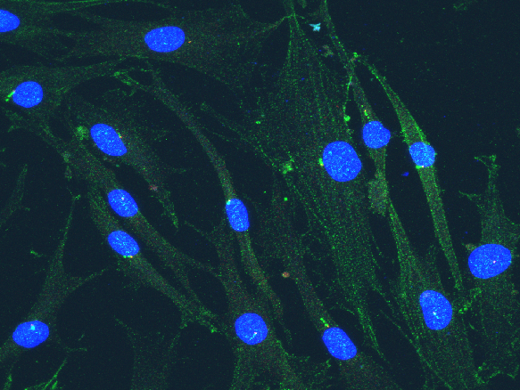
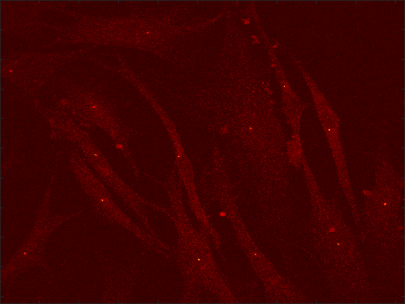
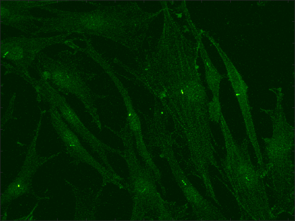
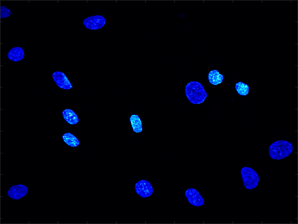
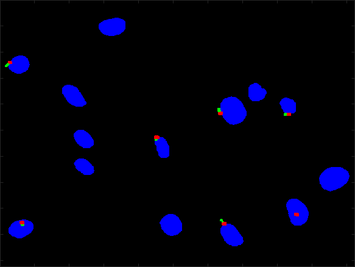

# Cilia

This repository contains the code developed through the project "Global Joint Research Center for the Development of Innovative Technology for Controlling Aging Based on Primary Cilia Metabolism" in collaboration between the teams of City St Georges, University of London, Yonsei and Sung Kyun Kwan Universities to analyse the cilia metabolism.

<a name="datasets"/>
<h2> Data sets </h2>
</a>

The input data for the code are multichannel volumetric '*.tiff' images. That is, the images will contain three channels, one for the nuclei stained for DAPI, one for the cilia and one for the basal body. Each channel can contain multiple slices as a volumetric stack. Most of the processing is done over the maximum intensity projection of each channel. As an example, the images below shows the maximum intensity projections of the combined channels as an RGB image and the separate channels.

  

<a name="description"/>
<h2> Brief description of using the code </h2>
</a>
Semantic segmentation of the cell nuclei, cilia and basal bodies is obtained with the code in the following way. The function readCilia will read the tiff file and separate the channels, in addition it will obtain the magnification (e.g., x20, x40, x60) and calibration factor (pixels to microns) from the metadata of the file. For this you will need to pass as input argument the name of the file:

<pre class="codeinput">
[CiliaVolume,magnification,calibrationFactor] = readCilia(currFile.tiff);    
</pre>

Then, the output arguments are used as input arguments of the next function:
<pre class="codeinput">
cp                      = cellpose(Model="nuclei");
Output                  = segmentCilia(CiliaVolume,cp,magnification,calibrationFactor);
</pre>

Notice that in addition, we are using the cellPose nuclei model (https://www.cellpose.org/) to segment the DAPI channel.

The variable output is a structure with the following fields:

<pre class="codeinput">
Output = 

  struct with fields:

           Input_MIP_RGB: [1024×1024×3 double]
         FinalNuclei_MIP: [1024×1024 double]
          FinalCilia_MIP: [1024×1024 double]
      FinalBasalBody_MIP: [1024×1024 double]
       FinalNuclei_MIP_P: [15×1 struct]
        FinalCilia_MIP_P: [11×1 struct]
    FinalBasalBody_MIP_P: [7×1 struct]
             CiliaLength: [1×11 double]
            NucleiLength: [1×15 double]
        FinalCombination: [1024×1024 double]
    FinalCombination_RGB: [1024×1024×3 logical]
             TotalNuclei: 14
              TotalCilia: 8
              TotalBasal: 7
               Ratio_C_N: 0.5714
               Ratio_B_C: 0.8750
           BasalBody_MIP: [1024×1024 double]
                DAPI_MIP: [1024×1024 double]
               Green_MIP: [1024×1024 double]
</pre>

For the current example, this is the graphical output of the segmentation, with nuclei in blue, cilia in green and basal body in red:

For batch processing of a number of images, it is possible to save all the images into a single folder, and then run all images with a for loop in the following way:

<pre class="codeinput">
dir0        = dir('*.tif');
numFiles    = numel(dir0);
for k=3%:numFiles
    currFile                = dir0(k).name;
    [CiliaVolume,magnification,calibrationFactor] = readCilia(currFile);    
    Output                  = segmentCilia(CiliaVolume,cp,magnification,calibrationFactor);
end    
</pre>

